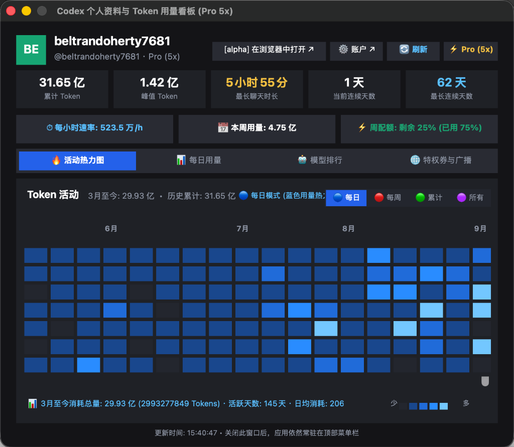
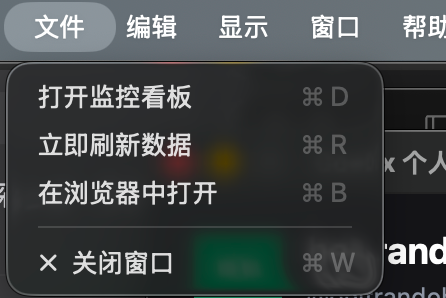

# Codex Monitor ☁

<p align="center">
  
  
  
  
  
</p>

<p align="center">
  <b>Blazing fast, ultra-lightweight, pure native macOS monitor and dashboard for OpenAI Codex</b><br>
  No Electron · No Tauri · No WebView · Only ~6MB Memory · 1.3MB Bundle Size
</p>

<p align="center">
  <a href="README.md"><b>简体中文</b></a> | <a href="README_EN.md"><b>English</b></a>
</p>

---

## 📸 Screenshots & UI Preview

<p align="center">
  
  <br>
  <em>Native Panoramic Dashboard: Metrics, Rate limit pills, GitHub-style Heatmap & codex-resets.com reset tracking</em>
</p>

<p align="center">
  
  <br>
  <em>Native Menu Bar Tray with 15s Throttle Cooldown</em>
</p>

---

## 📥 Download & Install (macOS)

Pre-built ready-to-run installation packages are provided directly in the repository:

| File | Format | Description | Download |
| :--- | :--- | :--- | :--- |
| **Codex-Monitor-macOS.dmg** | macOS DMG Disk Image | **Recommended**. Mount and drag `Codex Monitor.app` to `/Applications` | [⬇️ Download DMG (v0.1.0)](https://github.com/mhxy13867806343/ai-credit-limit-codex/releases/download/v0.1.0/Codex-Monitor-macOS.dmg) |
| **Codex-Monitor-macOS.zip** | ZIP Archive | Extract and launch `Codex Monitor.app` directly | [⬇️ Download ZIP (v0.1.0)](https://github.com/mhxy13867806343/ai-credit-limit-codex/releases/download/v0.1.0/Codex-Monitor-macOS.zip) |

> **Security Note**: If macOS displays an unidentified developer warning on first launch, open System Settings -> Privacy & Security and click "Open Anyway", or run `xattr -cr "/Applications/Codex Monitor.app"` in your terminal.

---

## ✨ Key Features

### 1. 🖥️ Native Panoramic Dashboard (760 × 630)
- **User Profile & Plan Badge**: Automatically extracts your Codex account email, username prefix, avatar initials, and subscription plan badge (`⚡ Pro (5x)` / `Team`).
- **5 Core Metric Cards**:
  - **Lifetime Tokens** (Dynamic compact Chinese/International formatting)
  - **Peak Daily Tokens**
  - **Longest Turn Duration** (Formatted cleanly in hours/minutes)
  - **Current Active Streak**
  - **Longest Active Streak**
- **3 Real-time Rate & Quota Pills**:
  - ⏱ Hourly consumption pace (`/h`)
  - 📅 Weekly token total
  - ⚡ Weekly quota remaining percentage
- **4 Switchable Core Data Views**:
  - 🔥 **Activity Heatmap**: 24-week GitHub-style grid supporting Daily, Weekly, Cumulative, and Panoramic modes with hover tooltips.
  - 📊 **Daily Usage (Bars)**: Day-by-day token consumption bar chart.
  - 🤖 **Model Ranking**: Dynamically inspects local SQLite threads and cache to calculate top-used models and reasoning effort distribution.
  - 🌐 **Perks & Broadcast**: Reset coupons, local workflow telemetry, and community broadcast.

### 2. ⚡ Full-Surface Skeleton Loading Animation
- During data sync and manual refresh, top metric cards, rate limits, and the bottom panel switch to high-framerate breathing skeleton placeholders that shimmer synchronously.

### 3. 🌐 Global Limit Reset Tracker (codex-resets.com)
- Header action pill **`🌐 Reset: Xh ago ↗`** dynamically scrapes and displays the latest worldwide Codex limit reset from [codex-resets.com](https://codex-resets.com/).
- Click directly opens the tracker in your default browser.

### 4. ⏱️ 15-Second Refresh Cooldown (Throttle)
- Prevents rate-limit abuse by enforcing a **15-second cooldown** after each manual refresh.
- Both the window refresh button and the top menu bar item display live countdown feedback (e.g. `🔄 Refresh (14s)`) and disable clicks during cooldown.

### 5. 📦 Intelligent Environment Detection & Guide
- Automatically verifies if Codex Desktop App or CLI is installed locally.
- When missing, displays a native AppKit onboarding guide with one-click official download and command-line installation (`npm i -g @openai/codex`) copy button.

### 6.  Native Application Menu & Status Bar Tray
- **When Focused**: Fully takes over the macOS system menu bar (` Codex Monitor File Edit View Window Help`) with standard shortcuts (⌘D dashboard, ⌘R refresh, ⌘1-4 views, ⌘W close, ⌘Q quit).
- **Background Tray**: Stays resident in the top-right menu bar with real-time quota status (`☁ Codex: 25% (Pro 5x)`).

---

## ⚡ Performance Comparison

| Metric | This Project (Rust + AppKit) | Tauri 2 | PyQt / Python | Electron |
| :--- | :--- | :--- | :--- | :--- |
| **RAM Usage** | **~6 MB** | 30 ~ 60 MB | 100 MB+ | 150 ~ 300 MB |
| **Bundle Size**| **1.3 MB** | 10 ~ 20 MB | 50 MB+ | 80 ~ 150 MB |
| **Launch Time**| **< 30 ms** | ~ 500 ms | ~ 1.5 s | ~ 2 s |
| **Runtime Deps**| **Zero Dependencies** | WebKit Engine | Python Runtime | Chromium + Node.js |

---

## 🛠️ Architecture & Engineering Principles

- **Strict Modularity**: Every single `.rs` file (26 files total) is strictly kept under **200 lines**.
- **Zero Hardcoding**: All models, dates, months, and configurations are dynamically derived from official JSON-RPC (`codex app-server --stdio`), SQLite databases, or live web feeds.

```
src/
├── main.rs                 # Application entrypoint & NSApplication lifecycle
├── config.rs               # Environment & binary detection
├── codex/                  # Codex data engine
│   ├── mod.rs              # Exports
│   ├── models.rs           # Serde data structs
│   ├── format.rs           # Token & duration formatting
│   ├── analytics.rs        # SQLite thread & model usage parsing
│   ├── rpc.rs              # codex app-server JSON-RPC communication
│   └── api.rs              # Web fallback & codex-resets.com scraper
├── menu/                   # Menu & tray modules
│   ├── mod.rs              # State management & 15s cooldown countdown
│   ├── builder.rs          # Status tray menu builder
│   ├── handler.rs          # Menu action handlers
│   └── main_menu.rs        # Native macOS application top menu bar
└── window/                 # Dashboard window & AppKit UI
    ├── mod.rs              # Window handles & triggers
    ├── types.rs            # Enums & view modes
    ├── state.rs            # Window root container & lifecycle
    ├── state_update.rs     # Data-driven view update & refresh sync
    ├── header.rs           # Profile, metric cards & action buttons
    ├── ui_helpers.rs       # Box/label helpers & color palettes
    ├── skeleton.rs         # Skeleton layout & pulse shimmer
    ├── heatmap_calc.rs     # 24-week heatmap computation & tooltips
    ├── panel_heatmap.rs    # Heatmap grid view
    ├── panel_bars.rs       # Daily usage bar chart
    ├── panel_models.rs     # Top models ranking view
    ├── panel_broadcast.rs  # Perks & broadcast telemetry view
    ├── panel_install.rs    # Native installation guide view
    └── handler.rs          # Window event handler
```

---

## 🔨 Local Build

```bash
# 1. Check syntax
cargo check

# 2. Run locally
cargo run

# 3. Build optimized macOS Application Bundle
./scripts/build-app.sh

# 4. Generate DMG and ZIP distribution packages
./scripts/package-release.sh
```

---

## 📄 License

Licensed under the [MIT License](LICENSE).
